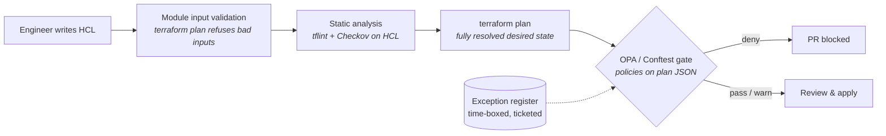

# Cloud Policy & Guardrails Lab

[](https://github.com/H3llKa1ser/Cloud-Policy-and-Guardrails-Lab/actions/workflows/guardrails.yml)

Policy-as-code guardrails for AWS infrastructure, built with **Terraform**, **Open Policy Agent (Rego)** and **Conftest**, and enforced in CI on every pull request.

The lab shows the full lifecycle of a cloud security control: a secure-by-default module that makes the right thing easy, a plan-time policy that blocks the wrong thing, a time-boxed exception process for the cases in between, and tests that prove each layer works. It runs **entirely offline**: no AWS account, no credentials, no cost.

```text
$ make gate-noncompliant
FAIL - aws.network - [NET_001] aws_security_group.legacy_admin: port 22 open to 0.0.0.0/0
FAIL - aws.compute - [CMP_001] aws_instance.jumpbox: metadata_options.http_tokens must be "required" (IMDSv2)
FAIL - aws.iam     - [IAM_004] aws_iam_role.vendor_access: assume_role_policy trusts any principal without a Condition
FAIL - aws.logging - [LOG_003] aws_cloudtrail.minimal: kms_key_id must be set
...
37 tests, 3 passed, 10 warnings, 24 failures, 0 exceptions
```

## Defence in depth

Each layer catches a different class of mistake at a different cost. The earlier a problem is caught, the cheaper it is to fix.



| Layer | Where | Catches | Example |
|---|---|---|---|
| Secure modules | `modules/` | Insecure defaults, by never offering them | `secure-s3-bucket` is always private, KMS-encrypted, versioned and TLS-only |
| Input validation | module `variables.tf` | Unsafe inputs before a plan exists | `restricted-security-group` rejects `0.0.0.0/0` on anything except 80/443 |
| Module tests | `modules/*/tests` | Regressions in the modules themselves | `terraform test` with a mocked provider asserts the secure defaults |
| Static scan | tflint, Checkov | Known-bad patterns in HCL, incl. values unknown at plan | Checkov's AWS ruleset; accepted risks are inline, justified `#checkov:skip` comments |
| **Plan gate** | `policies/` | Anything that reaches a plan, from any code, module or not | Custom Rego rules over `terraform show -json` |
| Exceptions | `exceptions/` | Legitimate exceptions, without disabling the control | Ticketed, justified, expires within 90 days |

## Quick start

Prerequisites: Terraform ≥ 1.9, OPA, Conftest, tflint, jq (and optionally Checkov).

```bash
make                    # everything CI runs: fmt, lint, validate, policy tests, module tests, gate, verify
make gate-compliant     # the compliant stack passes all guardrails
make gate-noncompliant  # the insecure stack, and everything the guardrails catch in it
make verify             # asserts the insecure stack trips exactly the expected rules
make scan               # Checkov static scan
```

Plans run in **offline lab mode**: the AWS provider is configured with dummy credentials and `skip_*` flags, and nothing in the stacks uses data sources that call AWS. Set `offline = false` to plan against a real account.

## Repository layout

```text
policies/
  lib/terraform.rego     plan-JSON helpers: unknown values, module paths, companion lookup, tags
  lib/exceptions.rego    exception validation and matching
  aws/*.rego             one package per domain (s3, network, compute, data_stores, iam, logging, tagging, governance)
  tests/                 67 OPA unit tests over synthetic plans (≥95% coverage enforced)
modules/
  secure-s3-bucket/      private, KMS-encrypted, versioned, TLS-only bucket
  restricted-security-group/  no inline rules, validated ingress, HTTPS-only egress by default
  audit-logging/         multi-region CloudTrail, log validation, KMS, CloudWatch Logs feed
examples/
  compliant/             realistic stack built from the modules; passes everything
  noncompliant/          23 deliberate misconfigurations + expected-violations.txt
exceptions/exceptions.yaml   the exception register
scripts/                 plan, gate, regression-assert and job-summary helpers
.github/workflows/       CI: lint, policy tests, module tests, plan gate matrix, Checkov + SARIF
```

Root stacks commit their `.terraform.lock.hcl` (multi-platform provider checksums), so CI and every contributor install byte-identical providers.

## Policy catalogue

`deny` blocks the merge. `warn` is advisory: it shows in the PR summary but does not fail the build, which is how a new rule can be rolled out before it is enforced.

| ID | Level | Rule | Why it matters |
|---|---|---|---|
| S3_001 | deny | Every bucket has a public access block | The single most common cause of cloud data leaks |
| S3_002 | deny | All four public access block flags are true | One `false` flag re-opens a path to public exposure |
| S3_003 | deny | Every bucket has default encryption | Encryption at rest for every object, not just the ones callers remember to encrypt |
| S3_004 | deny | No public canned ACLs | `public-read` exposes every object |
| S3_101 | warn | Prefer SSE-KMS over SSE-S3 | Customer-managed keys add an independent access control and an audit trail |
| S3_102 | warn | Versioning configured | Recovery from accidental or ransomware-style overwrites |
| NET_001 | deny | No sensitive port (SSH, RDP, DBs, caches, Docker API…) open to the internet | Direct path to brute force and exploitation |
| NET_002 | deny | No all-traffic ingress from the internet | Removes the perimeter entirely |
| NET_003 | deny | Default security group has no rules | Resources launched without an explicit SG silently inherit it |
| CMP_001 | deny | IMDSv2 required | Blocks SSRF-to-credential-theft (the Capital One pattern) |
| CMP_002 | deny | Root volumes encrypted (or account-level EBS encryption on) | Snapshot and disk exposure |
| CMP_003 | deny | EBS volumes encrypted | As above |
| CMP_101 | warn | Instance requests a public IP | Exposure should be a reviewed decision |
| DATA_001 | deny | Database storage encrypted | Encryption at rest for RDS and Aurora |
| DATA_002 | deny | Databases not publicly accessible | Databases belong in private subnets |
| DATA_003 | deny | Symmetric KMS keys rotate | Limits blast radius of key material exposure |
| IAM_001 | deny | No `Action "*"` on `Resource "*"` | Full administrator via a custom policy |
| IAM_002 | deny | No `iam:*`, `kms:*`, `sts:*`, `organizations:*` on `"*"` | Privilege escalation and key takeover |
| IAM_003 | deny | No AWS-managed admin policy attachments | `AdministratorAccess` / `IAMFullAccess` |
| IAM_004 | deny | No role any AWS principal can assume without a Condition | Cross-account takeover |
| IAM_101 | warn | No long-lived access keys | Leaked keys are a top initial-access vector; prefer roles / Identity Center |
| IAM_102 | warn | No permissions attached to users | Group- and role-based access is auditable |
| IAM_103 | warn | No Allow + NotAction | Almost always broader than intended |
| LOG_001 | deny | CloudTrail is multi-region | Attackers operate in regions nobody watches |
| LOG_002 | deny | Log file validation on | Tamper evidence for forensics |
| LOG_003 | deny | Trail encrypted with KMS | Protects logs and adds a second access control |
| LOG_004 | deny | Global service events included | Captures IAM and STS activity |
| LOG_101 | warn | Log groups have retention | Cost, and a deliberate retention decision |
| LOG_102 | warn | Log groups use KMS | Confidentiality of log data |
| TAG_001 | deny | `DataClassification` uses the approved vocabulary | Data handling rules depend on it |
| TAG_002 | deny | `Environment` uses the approved vocabulary | Consistent scoping for alerts and access |
| TAG_101 | warn | `Owner`, `Environment`, `DataClassification` present | Every finding needs an owner to route to |
| GOV_001 | deny | Exceptions are complete | No anonymous or unjustified exceptions |
| GOV_002 | deny | Exceptions expire within 90 days | No permanent exceptions |
| GOV_101 | warn | Expired exceptions are flagged | Keeps the register clean |

## How the policies work

The gate evaluates `terraform show -json` output rather than HCL, so it sees the **resolved** result of variables, modules, `count`/`for_each` and provider `default_tags`, and it judges every resource regardless of whether it came from a blessed module. Doing that correctly means handling a few plan-format realities, all centralised in `policies/lib/terraform.rego`:

- **Only creates and updates are judged.** Deleting a non-compliant resource must never be blocked.
- **"Known after apply" values.** An attribute that references a resource in the same plan (for example a CloudTrail `kms_key_id` pointing at a new key) is absent from `after` and marked in `after_unknown`. `is_set()` treats both as set, so LOG_003 does not false-positive on correctly built stacks.
- **Companion resources.** Since AWS provider v4, a bucket's security settings live in separate resources (`aws_s3_bucket_public_access_block` and friends) whose `bucket` argument is unknown at plan time. The library follows the **references** recorded in the plan's `configuration` section instead, resolving nested module paths and stripping `count`/`for_each` keys, so S3_001 correctly matches a block to its bucket even through nested modules, and does *not* accept a block that targets a different bucket.
- **Tags.** `tags_all` is normally known at plan time, but becomes unknown when a provider has no `default_tags`. Rather than skipping (which would let an untagged provider alias bypass TAG_101), the library rebuilds effective tags from the provider configuration, and only skips when `default_tags` is genuinely dynamic.
- **Stable rule IDs.** Every finding is `[ID] address: message`, which makes findings greppable, exception-able and testable.

### Testing the guardrails themselves

A guardrail nobody tests is a guardrail nobody trusts. There are three levels:

1. **Unit tests** (`opa test`): synthetic plans exercise every rule, positive and negative, including edge cases like nested modules, IPv6, port ranges and conditioned trust policies. CI enforces ≥95% coverage.
2. **Module tests** (`terraform test` with `mock_provider`): prove the modules' secure defaults and input validations, offline. Writing these caught a real bug during development: the bucket module originally decided whether to create a KMS key with `count = var.kms_key_arn == null`, which fails when the caller passes a key created in the same plan.
3. **Regression against a real plan** (`make verify`): the non-compliant stack is planned and the exact set of rule IDs reported is diffed against `expected-violations.txt`. A rule that silently stops firing, or a new false positive, fails CI. Break a rule on purpose and watch it fail:

   ```diff
   --- expected
   +++ actual
   -deny CMP_001
    deny CMP_002
   ```

## Exceptions

Sometimes a finding is accepted risk. Disabling the rule is the wrong answer; recording the exception is the right one. Add an entry to `exceptions/exceptions.yaml`:

```yaml
exceptions:
  - rule: NET_001
    address: aws_vpc_security_group_ingress_rule.postgres_public
    ticket: SEC-1042
    justification: BI vendor IP allow-list pending; tracked for removal
    expires: "2026-11-15T00:00:00Z"
```

Exceptions are scoped to one rule and one address (globs allowed within an address segment), must carry a ticket and justification, and cannot run longer than 90 days. Invalid exceptions suppress nothing and fail the build (GOV_001, GOV_002); expired ones stop suppressing and raise a warning (GOV_101). The governance rules themselves cannot be excepted. Because the register lives in Git, every exception has an author, a reviewer and a history.

## Why both Checkov and OPA?

| | Checkov (static HCL) | OPA / Conftest (plan JSON) |
|---|---|---|
| Sees values only known after apply (e.g. IAM policy built from a module output) | Partially, from HCL | No |
| Sees resolved variables, `for_each`, modules, `default_tags` | Partially | Yes |
| Organisation-specific rules (tag vocabularies, exception process) | Possible but awkward | Native |
| Off-the-shelf coverage | Hundreds of checks | Only what you write |

They complement each other. The compliant stack, for example, builds its IAM policy from module outputs, so the plan cannot show the final document to OPA. Checkov still analyses the HCL.

## Known limitations

- Plan-time policies are **preventive for Terraform only**. Console changes, other IaC tools and drift need detective controls (AWS Config rules, Security Hub) and preventive org-level controls (SCPs). This lab is the shift-left layer of that stack, not a replacement for it.
- Values unknown at plan time cannot be judged by plan-time policies (see the IAM example above).
- Each plan is evaluated in isolation. Rules that need account-wide context ("does a multi-region trail exist anywhere?") belong in a detective control.

## Exercises

Ideas for extending the lab, roughly in order of difficulty:

1. Add VPC flow logs to the compliant stack and remove its `CKV2_AWS_11` skip.
2. Write `NET_004`: database security groups must not allow egress to `0.0.0.0/0`. Add a unit test, a resource in the non-compliant stack and a line in `expected-violations.txt`.
3. Add a rule requiring ALB listeners on port 80 to redirect to HTTPS.
4. Teach the IAM rules to read `aws_iam_policy_document` statements from the configuration section, so policies built from module outputs can be judged at plan time.
5. Add OPA metadata annotations mapping each rule to CIS AWS Foundations and NIST 800-53 controls, and generate a compliance report from them.
6. Add an `scp-baseline` module (deny `cloudtrail:StopLogging`, deny leaving the organisation, region restriction) and a rule that SCPs are present in the management account stack.
7. Run the gate in Atlantis, Spacelift or HCP Terraform run tasks instead of GitHub Actions.
8. Port the policy library to Azure or GCP resources.

## Running against a real AWS account

```bash
cd examples/compliant
terraform init
terraform plan -var offline=false -var account_id=$(aws sts get-caller-identity --query Account --output text) -var ami_id=<hardened AMI>
```

Never apply `examples/noncompliant`.

## License

MIT
