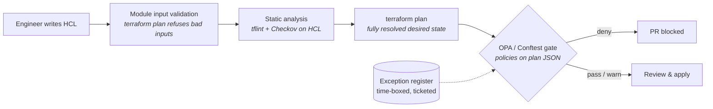

# Cloud Policy & Guardrails Lab

[](https://github.com/H3llKa1ser/Cloud-Policy-and-Guardrails-Lab/actions/workflows/guardrails.yml)

Policy-as-code guardrails for AWS infrastructure, built with **Terraform**, **Open Policy Agent (Rego)** and **Conftest**, and enforced in CI on every pull request.

The lab shows the full lifecycle of a cloud security control: a secure-by-default module that makes the right thing easy, a plan-time policy that blocks the wrong thing, a time-boxed exception process for the cases in between, and tests that prove each layer works. It runs **entirely offline**: no AWS account, no credentials, no cost.

```text
$ make gate-noncompliant
FAIL - aws.network - [NET_001] aws_security_group.legacy_admin: port 22 open to 0.0.0.0/0
FAIL - aws.compute - [CMP_001] aws_instance.jumpbox: metadata_options.http_tokens must be "required" (IMDSv2)
FAIL - aws.iam     - [IAM_004] aws_iam_role.vendor_access: assume_role_policy trusts any principal without a Condition
FAIL - aws.logging - [LOG_003] aws_cloudtrail.minimal: kms_key_id must be set
...
37 tests, 3 passed, 10 warnings, 24 failures, 0 exceptions
```

## Defence in depth

Each layer catches a different class of mistake at a different cost. The earlier a problem is caught, the cheaper it is to fix.



| Layer | Where | Catches | Example |
|---|---|---|---|
| Secure modules | `modules/` | Insecure defaults, by never offering them | `secure-s3-bucket` is always private, KMS-encrypted, versioned and TLS-only |
| Input validation | module `variables.tf` | Unsafe inputs before a plan exists | `restricted-security-group` rejects `0.0.0.0/0` on anything except 80/443 |
| Module tests | `modules/*/tests` | Regressions in the modules themselves | `terraform test` with a mocked provider asserts the secure defaults |
| Static scan | tflint, Checkov | Known-bad patterns in HCL, incl. values unknown at plan | Checkov's AWS ruleset; accepted risks are inline, justified `#checkov:skip` comments |
| **Plan gate** | `policies/` | Anything that reaches a plan, from any code, module or not | Custom Rego rules over `terraform show -json` |
| Exceptions | `exceptions/` | Legitimate exceptions, without disabling the control | Ticketed, justified, expires within 90 days |

## Quick start

Prerequisites: Terraform ≥ 1.9, OPA, Conftest, tflint, jq, Python 3.10+ (and optionally Checkov).

```bash
git clone https://github.com/H3llKa1ser/Cloud-Policy-and-Guardrails-Lab.git
cd
